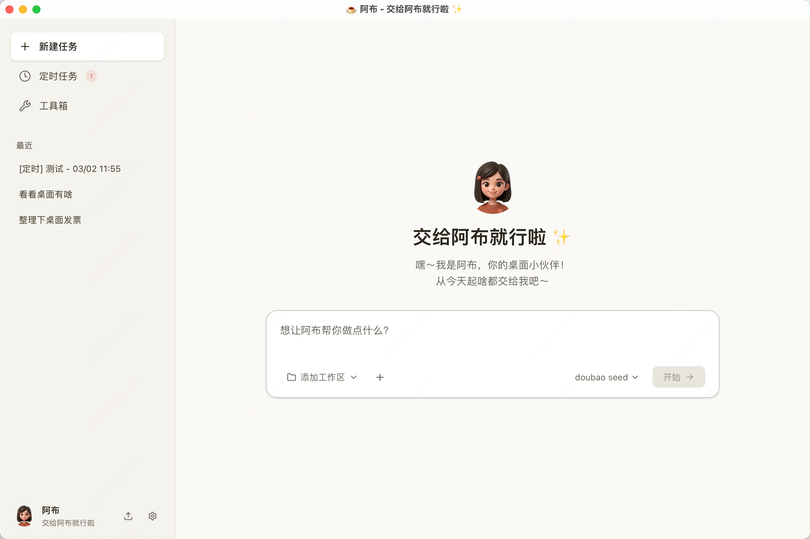
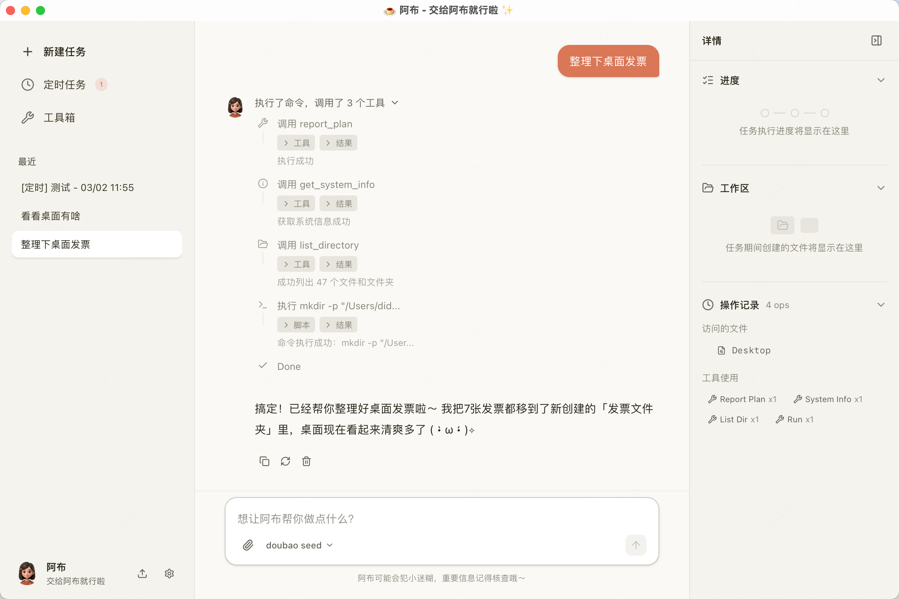
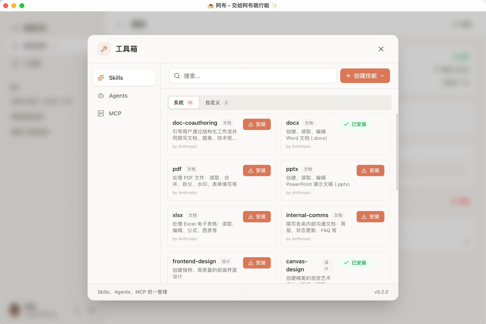
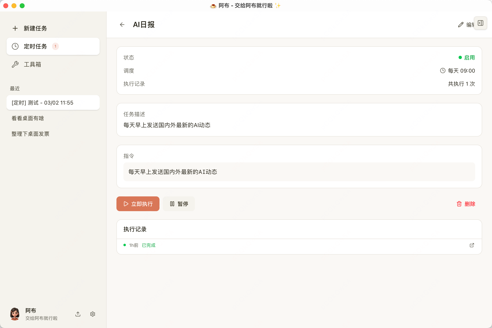
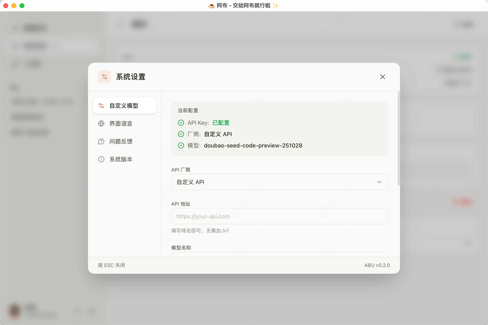

<div align="center">

**English** | [中文](README_CN.md)


# Abu (阿布)

**Your AI Desktop Office Assistant — Just Leave It to Abu**

A locally-run AI desktop assistant inspired by Claude Code's Cowork mode.
Tell Abu what you need — it reads files, runs commands, writes docs, and builds reports, all on your machine.

[](https://github.com/PM-Shawn/Abu-Cowork/releases)
[](LICENSE)

[Download](#-download) · [Quick Start](#-quick-start) · [Features](#-features) · [Build from Source](#-build-from-source)

</div>

---

## Preview

> Clean interface, powerful capabilities

### Conversational Interaction
Tell Abu what you want in natural language — conversation is the command.



### Task Execution
Intelligently invokes tools to complete complex tasks like file organization automatically.



### Toolbox
Rich collection of Skills, Agents, and MCP tools — install on demand to extend capabilities.



### Scheduled Tasks
Set up recurring schedules and let Abu work for you automatically every day.



### Custom Models
Bring your own API keys and models — flexibly connect to various LLM providers.



## Features

- **Autonomous Agent** — More than chat: plans, invokes tools, reads/writes files, executes commands, and completes complex tasks
- **Skill System** — Built-in skills for translation, weekly reports, code review, deep research, article writing, and more — one-click install, fully customizable
- **MCP Protocol** — Connect to databases, search engines, GitHub, and other external services via Model Context Protocol
- **Scheduled Tasks** — Set recurring schedules for Abu to run tasks automatically (e.g., daily AI news digest every morning)
- **Multi-Model Support** — Works with Anthropic Claude, DeepSeek, Qwen, Doubao, Moonshot, GLM, and other major LLM providers
- **Sandbox Security** — macOS Seatbelt sandbox isolation + sensitive path protection + command safety checks
- **Local-First** — Your data stays local, your API keys stay local — nothing goes through third-party servers
- **Cross-Platform** — Supports macOS (Apple Silicon / Intel) and Windows

## Download

Head to [GitHub Releases](https://github.com/PM-Shawn/Abu-Cowork/releases) to download the latest version:

| Platform | File |
|----------|------|
| macOS (Apple Silicon) | `Abu_x.x.x_aarch64.dmg` |
| macOS (Intel) | `Abu_x.x.x_x64.dmg` |
| Windows | `Abu_x.x.x_x64-setup.exe` |

> **macOS Users**: If you see a "damaged" warning on first launch, run `xattr -cr /Applications/Abu.app`. See the [Installation Guide](docs/Installation-Guide.md) for details.

## Quick Start

1. Download, install, and open Abu
2. Click the settings icon at the bottom left, go to "Custom Models"
3. Choose your API provider and enter your API Key
4. Return to the main screen and start chatting

**Try these prompts:**

```
Organize the files on my desktop by type
```
```
Extract the tables from this PDF and generate an Excel file
```
```
Every morning at 9 AM, search for the latest AI news and generate a daily digest
```

## Tech Stack

| Layer | Technology |
|-------|-----------|
| Desktop Framework | Tauri 2.0 (Rust + Web) |
| Frontend | React 19 + TypeScript + TailwindCSS v4 + Vite |
| LLM | Multi-model adapter (Anthropic / OpenAI-compatible) |
| State Management | Zustand + Immer |
| Tool Protocol | MCP (`@modelcontextprotocol/sdk`) |
| Sandbox | macOS Seatbelt + path/command dual validation |
| UI | Radix UI + Lucide Icons |
| Testing | Vitest + happy-dom |

## Build from Source

### Prerequisites

- Node.js >= 18
- Rust >= 1.75 ([Install Rust](https://rustup.rs/))
- Tauri 2.0 system dependencies ([See docs](https://v2.tauri.app/start/prerequisites/))

### Development

```bash
# Clone the repo
git clone https://github.com/PM-Shawn/Abu-Cowork.git
cd Abu-Cowork

# Install dependencies
npm install

# Launch desktop app (recommended)
npm run tauri dev

# Frontend only (no Rust required)
npm run dev
```

### Build

```bash
npm run tauri build
```

Build artifacts are located in `src-tauri/target/release/bundle/`.

### Testing

```bash
npm test              # Run tests
npm run test:watch    # Watch mode
npm run test:coverage # Coverage report
npm run lint          # ESLint check
```

## Project Structure

```
src/
├── components/       # React UI components
│   ├── chat/         # Chat interface, message bubbles, Markdown rendering
│   ├── sidebar/      # Sidebar navigation
│   ├── panel/        # Right-side detail panel
│   ├── schedule/     # Scheduled task views
│   ├── settings/     # System settings
│   └── ui/           # Base UI components (shadcn/Radix)
├── core/             # Core engine (non-UI)
│   ├── agent/        # Agent loop, retry, memory
│   ├── llm/          # LLM adapter layer (Claude + OpenAI-compatible)
│   ├── tools/        # Tool registry, built-in tools, safety checks
│   ├── mcp/          # MCP client
│   ├── skill/        # Skill loading & preprocessing
│   ├── scheduler/    # Scheduling engine
│   ├── context/      # Context management & token estimation
│   └── sandbox/      # Sandbox configuration
├── stores/           # Zustand state management
├── hooks/            # React Hooks
├── i18n/             # Internationalization (Chinese / English)
├── types/            # TypeScript type definitions
└── utils/            # Utility functions

builtin-skills/       # Built-in skill definitions (translation, reports, code review, etc.)
builtin-agents/       # Built-in agent definitions
src-tauri/            # Tauri Rust backend (sandbox, command execution, network proxy)
abu-browser-bridge/   # Browser bridge service
abu-chrome-extension/ # Chrome extension
```

## Contributing

Issues and Pull Requests are welcome!

1. Fork this repo
2. Create your branch: `git checkout -b feat/my-feature`
3. Commit your changes: `git commit -m 'feat: add my feature'`
4. Push to the branch: `git push origin feat/my-feature`
5. Open a Pull Request

## Feedback & Community

Got questions or ideas? Scan the QR code to join the WeChat group:


## Support

If Abu has been helpful to you, feel free to buy the author a coffee:


## License

[Abu License](LICENSE) — Free for personal, educational, and non-commercial use. Copyright notices must be retained and may not be modified or removed. Commercial use requires authorization. See [LICENSE](LICENSE) for details.
